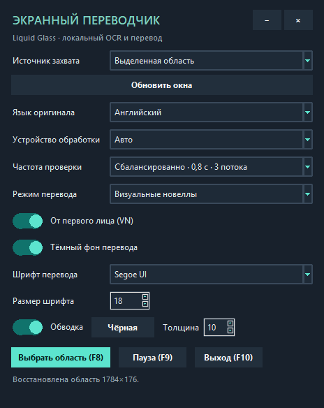

# Экранный переводчик для Windows

Небольшая программа переводит текст из выбранной области экрана на русский. OCR выполняется локально через EasyOCR, а перевод — локально через Argos Translate. API-ключ и регистрация не нужны; после загрузки языковых моделей интернет для перевода не требуется.

## Быстрая установка (Windows 10/11)

Скачайте `ScreenTranslator-Setup.exe` из раздела [Releases](https://github.com/hikeriirai/ScreenTranslator/releases) и запустите установщик. Он устанавливает приложение с встроенным Python runtime, CPU-зависимостями, OCR-моделями английского и японского языков и моделями перевода японский → английский → русский. Отдельный Python устанавливать не нужно. После установки для распознавания и перевода интернет не нужен.

Установщик рассчитан на Windows x64 и устанавливает программу в профиль текущего пользователя; права администратора не требуются. Установщик содержит CPU-вариант, не меняет видеодрайвер и не устанавливает CUDA Toolkit. Если выбрать GPU, но CUDA runtime PyTorch отсутствует, программа явно переключится на CPU. CUDA Toolkit для runtime не требуется. Для исходной сборки с NVIDIA GPU см. раздел ниже.

По пользовательской оценке, перевод в целом близок к 95% точности; оставшиеся ошибки чаще связаны с контекстом и местоимениями. Это субъективная оценка, а не результат формального тестирования; качество зависит от исходного текста и OCR.

## Интерфейс



## Запуск из исходного кода

1. Установите Python 3.10, 3.11 или 3.12 с сайта python.org. При установке включите пункт **Add Python to PATH**.
2. Откройте эту папку в VS Code.
3. Самый простой вариант: дважды щёлкните `run.bat`. При первом запуске скрипт создаст `.venv` и установит пакеты. Для этой установки нужен интернет.
4. Для ручного запуска из терминала VS Code создайте окружение на Python 3.10 (или замените `3.10` на установленную версию 3.11/3.12), затем установите пакеты и запустите приложение:

   ```powershell
   py -3.10 -m venv .venv
   .\.venv\Scripts\python.exe -m pip install -r requirements.txt
   .\.venv\Scripts\python.exe main.py
   ```

   Если хотите запускать именно командой `python main.py`, в VS Code выберите интерпретатор `.venv` через `Ctrl+Shift+P` → **Python: Select Interpreter**. Python 3.13/3.14 пока не поддерживаются используемым набором зависимостей; `run.bat` сам выберет подходящую установленную версию.

При первом OCR EasyOCR автоматически скачает модель выбранного языка. В приложении оставлены английский и японский языки оригинала. При первом переводе программа также загрузит модель Argos: английский → русский или японский → английский → русский. Для первоначальной загрузки нужен интернет; затем распознавание и перевод работают локально.

По умолчанию источник — **«Активное окно»**: захватывается только клиентская область приложения в фокусе, не весь рабочий стол. При переключении на другую программу OCR останавливается и продолжается после возврата в игру. В этом режиме нижняя строка меню визуальной новеллы (например, History, Skip, Auto/Automatic и Settings) пропускается, если распознано несколько соседних пунктов меню; сюжетные реплики остаются в обработке. Чтобы закрепиться за конкретным приложением, нажмите «Обновить окна» и выберите его; для ручного прямоугольника явно выберите «Выделенная область» и нажмите F8. Последняя ручная область сохраняется между запусками в `%APPDATA%\ScreenTranslator\region.json`. Окна перевода исключаются из поддерживаемого Windows-захвата, а собственная панель и оверлей дополнительно маскируются перед OCR.

В списке **Частота проверки** доступны профили: «Экономно» (1,5 секунды, 2 потока CPU, кадр до 720 px), «Сбалансированно» (0,8 секунды, 3 потока/960 px), «Быстро» (0,4 секунды, 3 потока/1280 px) и «Максимально быстро» (0,2 секунды, 4 потока/1600 px). По умолчанию включён сбалансированный профиль. OCR использует приоритет фонового потока Windows, чтобы уступать активному окну и вводу пользователя. Интервал — целевой период между проверками: если OCR работает дольше, программа заменяет очередь свежим кадром вместо накопления кадров. OCR накапливает постепенно появляющийся текст и отправляет его на перевод после 0,65–1,2 секунды без изменений (задержка учитывает частоту сканирования, чтобы успел распознаться соседний фрагмент реплики); если короткая надпись исчезает раньше, накопленный контекст всё равно отправляется. Уже показанный одинаковый текст не ставится в очередь повторно, а переводы дополнительно кэшируются. Окно перевода убирается через 1,2 секунды после исчезновения исходной надписи. Отдельные числа и типичные игровые индикаторы и строки характеристик (HP, MP, VIT, STR, DEX, Armor, Crit DMG, MP Cost и другие) отбрасываются после группировки OCR, а цифры, стоящие рядом с обычным текстом (например, даты), сохраняются. В обычном режиме соседние OCR-фрагменты объединяются по вертикальному положению и порядку чтения, даже если их рамки слегка перекрываются. Это помогает не разрывать предложения на сканах и страницах с печатным текстом; крупные межстрочные промежутки (например, между пунктами меню) и отдельный заголовок остаются отдельными переводами. В японском тексте маленькие надстрочные подсказки чтения над кандзи не отправляются в перевод отдельно. В режиме VN OCR-блоки объединяются в одно контекстное предложение до перевода: английские строки, перенесённые на экране, соединяются пробелом, а японские — без пробела. По умолчанию включена галочка **«От первого лица (VN)»**: она преобразует обращения к игроку в английском тексте и в промежуточном английском переводе с японского перед отправкой в Argos (например, `You grab the handle` → `I grab the handle`). Содержимое кавычек и скобок не меняется; выключите галочку, если нужно сохранить исходное лицо. В обычном режиме эта обработка не применяется. Весь найденный текст кадра показывается одним окном.

Для переводных окон можно переключить тёмный фон и обводку, выбрать шрифт и размер, а также задать цвет и толщину обводки. Переключатели оформлены в общем стеклянном стиле панели, плавно анимируются и работают мышью и клавишами `Space`/`Enter`. По умолчанию используются тёмный фон, Segoe UI 18 и чёрная обводка толщиной 10 px. Переводное окно можно перемещать и менять его размер за нижний правый угол: длинный перевод переносится по строкам, а размер шрифта при необходимости уменьшается; если весь текст всё ещё не помещается по высоте, окно расширяется, чтобы ничего не обрезать. Во время изменения размера перерисовка ограничена примерно 15 кадрами/с, промежуточный размер округляется, шрифты и готовые растры кэшируются; итоговое положение курсора применяется сразу после отпускания мыши. Уже переведённый текст не отправляется на перевод повторно. Переводное окно по умолчанию располагается рядом с оригиналом, а не поверх него; при нехватке места выбирается позиция с минимальным перекрытием. Это сохраняет читаемость оригинала и не даёт OCR повторно распознавать текст оверлея как часть игры. Окно основной программы тоже оформлено в стеклянном стиле и перемещается за заголовок. Окно выделения области показывает компактную стеклянную подсказку и не закрывает выбранный участок экрана.

В списке **Устройство обработки** доступны режимы «Авто», «CPU» и «GPU». GPU используется для EasyOCR и Argos Translate, только если CUDA runtime PyTorch и устройство CTranslate2 оба доступны. Обычный `run.bat` устанавливает CPU-вариант; на системе без CUDA-сборки PyTorch даже выбор GPU корректно остаётся на CPU. Для GPU-OCR в исходной сборке установите отдельный набор через pip в терминале VS Code:

```powershell
.\.venv\Scripts\python.exe -m pip install -r requirements-gpu.txt
```

Это большая загрузка PyTorch CUDA и библиотек NVIDIA (CUDA wheel PyTorch около 2,6 ГБ); вручную устанавливать CUDA Toolkit не нужно. После установки перезапустите приложение и выберите «Авто» или «GPU». Для AMD GPU ускорение Argos Translate на Windows текущей сборкой не поддерживается: у используемого CTranslate2 нет готового HIP/ROCm backend для этой Windows-сборки; перевод будет выполняться на CPU. Экономный профиль ограничивает OCR двумя CPU-потоками и уменьшает кадр до 720 px.

## Управление

- `F8` — выбрать или перевыбрать область; зажмите левую кнопку мыши и протяните рамку. `Esc` отменяет выбор.
- `F9` — пауза или продолжение.
- `F10` — выход.
- Язык оригинала выбирается явно: английский или японский. Автоопределения языка нет.
- В обычном режиме каждую надпись можно перетащить отдельно; в режиме визуальной новеллы окно реплики размещается рядом с диалогом. Клики проходят сквозь оверлей в Windows.

## Проверка

Регрессионные тесты чистой логики OCR и оверлея запускаются из корня проекта:

```powershell
.\.venv\Scripts\python.exe -m unittest discover -s tests -v
```

Для разработчиков, желающих пересобрать Windows-установщик, выполните `.\build.ps1` в PowerShell. Сборка использует зависимости из `.venv`, модели EasyOCR из `%USERPROFILE%\.EasyOCR\model` и установленные пакеты Argos. Скрипт создаёт standalone-сборку PyInstaller, включает модели и проверяет её запуск до и после тихой установки. Для этого нужны Inno Setup 6 и интернет при первой установке PyInstaller; сам готовый установщик работает офлайн.

## Частые проблемы

- **F-клавиши не работают в игре.** Проверьте, что программа запущена, а игра не перехватывает эти клавиши. В некоторых играх и при ограничениях Windows глобальные клавиши могут требовать запуска VS Code или `run.bat` от имени администратора.
- **Первый запуск долго загружает OCR или не хватает памяти.** Готовый установщик уже содержит OCR-модели; для запуска из исходного кода EasyOCR может скачать модель выбранного языка.
- **Текст читается плохо.** Увеличьте выделенную область, сделайте текст крупнее/контрастнее и выберите его исходный язык явно.
- **Перевод не появляется при первом запуске языка.** Готовый установщик содержит модели Argos. При запуске из исходного кода проверьте интернет для первоначальной загрузки; последующие переводы выполняются без сети.
- **Окно не видно поверх игры.** Переключите игру из эксклюзивного полноэкранного режима в оконный или безрамочный; некоторые полноэкранные игры скрывают сторонние окна.

## Примечания

Захват и OCR ограничены выбранной частотой и запускаются при изменении изображения. EasyOCR использует CPU; выбранный GPU ускоряет OCR и локальный перевод Argos. Для японского Argos переводит через английский, поэтому качество может отличаться от онлайн-переводчиков. Панель и оверлей собраны на Tkinter; ручная область работает на виртуальном экране нескольких мониторов.